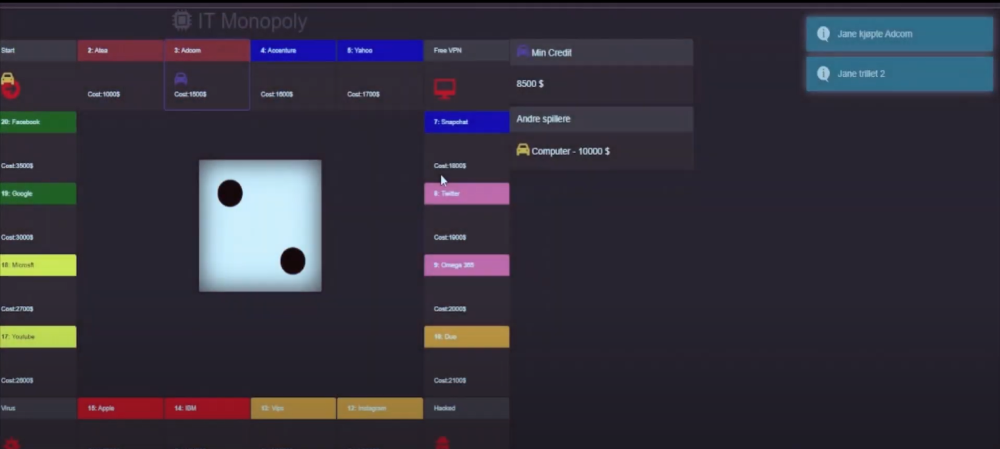

# ITMonopol

Dette prosjektet er en implementering av et monopol-lignende IT-basert spill, utviklet som en del av batcheloren ved Universitetet i Bergen i INFO212.
Spillet er i hovedsak laget i javscript, med largning av user state med C# og SQL Server.

## Installasjon

1. Klon dette repositoriet ved å kjøre følgende kommando i terminalen
``
   git clone https://github.com/eriksv88/ITMonopol.git
``
2. Gå inn i den klonede mappen ved å skrive:
``
cd ITMonopol
``

4. Installer avhengigheter ved hjelp av:
``
npm install
``

Følg instruksjonene på skjermen for å spille spillet.

## Demo

Se en demo av prosjektet https://www.youtube.com/watch?v=QGOzuD9I8Y4
